# cogniCraft

This is a memory game web application which is fully responsive. This site has been built to showcase my initial javascript skills as my very first Java code!

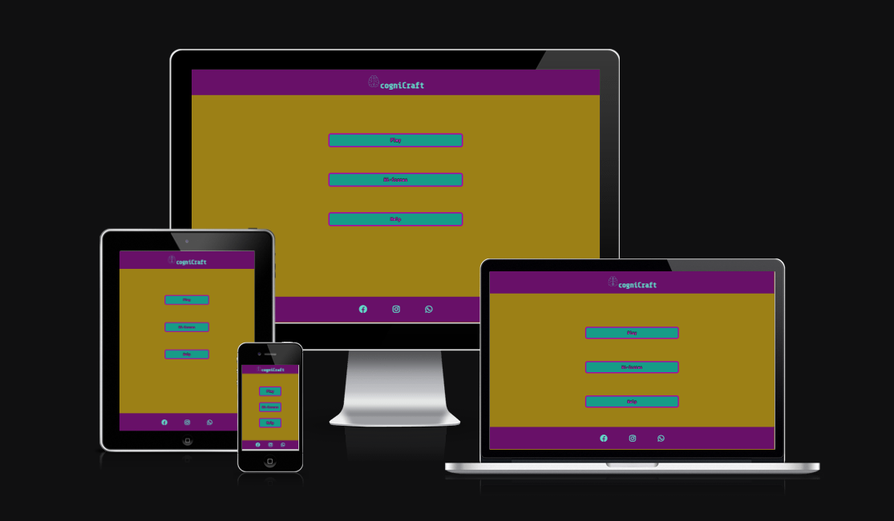

[View cogniCraft on github pages ](https://nmyhi.github.io/cogniCraft/)

---

## CONTENTS

* [User Experience](#user-experience-ux)
  * [User Stories](#user-stories)

* [Design](#design)
  * [Colour Scheme](#colour-scheme)
  * [Typography](#typography)
  * [Imagery](#imagery)
  * [Wireframes](#wireframes)

* [Features](#features)
  * [General Features on Each Page](#general-features-on-each-page)
  * [Future Implementations](#future-implementations)
  * [Accessibility](#accessibility)

* [Technologies Used](#technologies-used)
  * [Languages Used](#languages-used)
  * [Frameworks, Libraries & Programs Used](#frameworks-libraries--programs-used)

* [Deployment & Local Development](#deployment--local-development)
  * [Deployment](#deployment)
  * [Local Development](#local-development)
    * [How to Fork](#how-to-fork)
    * [How to Clone](#how-to-clone)

* [Testing](#testing)

* [Credits](#credits)
  * [Code Used](#code-used)
  * [Content](#content)
  * [Media](#media)
  * [Acknowledgments](#acknowledgments)

---

## User Experience (UX)

### Initial Discussion

cogniCraft is a simple 16 tiles memory game. The game has a main menu: play, High-Scores and Help.
The goal is to beat the 16 tiles memory game within the least amount of time.

### User Stories

#### Client Goals

* To navigate in the menu.
* To play the game.
* To have fun by trying to comple it within the least amount of time.
* To access previously played time record in the High Score menu.
* To access the developer's personal social-media using the footer links.

#### First Time Visitor Goals

* I want to play the game with no issues
* I want to navigate in the menu

#### Returning Visitor Goals

* I want to beat my previous record
* I want to be able to contact the developer if I need to.

#### Frequent Visitor Goals

* I want to have fun!

## Design

### Colour Scheme

I have chosen a vibrant colour sceme for this project and tried to make it interesting.

I like to include a palette of the colour scheme here, my favourite site for creating a colour palette is [coolors](https://coolors.co/), but there are lots of other sites that also do the same thing, like [ColorSpace](https://mycolor.space/?hex=%23F5F5F5&sub=1), [Muzli Colors](https://colors.muz.li/), [Adobe Colour Wheel](https://color.adobe.com/create/color-wheel) and [Canva](https://www.canva.com/colors/color-palette-generator/) to name a few.

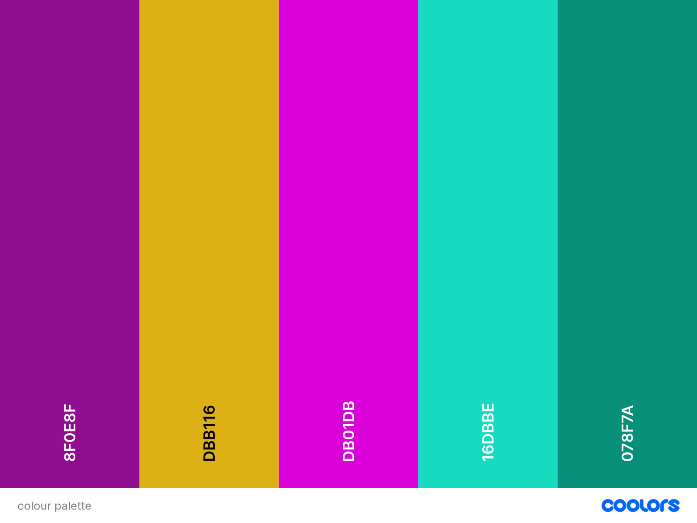

### Typography

I have imported a font family for this project from google fonts. It is callled: Share Tech Mono

I chose this font style because I think it's sci-fi appereance matches with my game style.

I used font-weight: 400.

I also like to include an image of the fonts chosen as a reference.

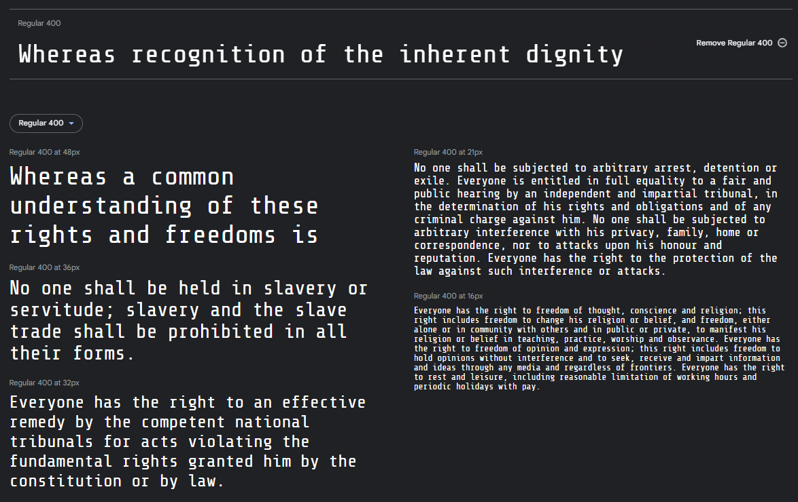

[Google Fonts](https://fonts.google.com/) is a popular choice for importing fonts to use in your project, as it doesn't require you to download the fonts to use them.

### Imagery

I used a single image for this project which has been created by my graphics designer friend. I used the image as the game logo and the favicon.

### Wireframes

Desktop view wireframes:

[Main Menu](assets/images/readme/desktopmainmenuwireframe.png)

[Game](assets/images/readme/desktopgamewindowwireframe.png)

[Hi-Scores](assets/images/readme/desktophiscoreswireframe.png)

[Help](assets/images/readme/desktophelpwireframe.png)

Mobile and tablet view wireframes:

[Main Menu](assets/images/readme/mobilemainmenuwireframe.png)

[Game](assets/images/readme/mobilegamewindowwireframe.png)

[Hi-Scores](assets/images/readme/mobilehiscoreswireframe.png)

[Help](assets/images/readme/mobilehelpwireframe.png)

There are lots of different options to create your wireframes - Code Institute students can access [Balsamiq](https://balsamiq.com/) as part of the course.

Some other options include [Figma](https://www.figma.com/), [AdobeXD](https://www.adobe.com/products/xd.html), [Sketch](https://www.sketch.com/?utm_source=google&utm_medium=cpc&adgroup=uxui&device=c&matchtype=e&utm_campaign=ADDICTMOBILE_SKETCH_GAD_DG_UK_T1_ALWAYS-ON_S_TRF_PROS_BRAND&utm_term=sketch&utm_source=google&utm_medium=cpc&utm_content=TOF_BRND__generic&hsa_acc=8710913982&hsa_cam=16831089317&hsa_grp=134620695759&hsa_ad=592060065319&hsa_src=g&hsa_tgt=kwd-14921750&hsa_kw=sketch&hsa_mt=e&hsa_net=adwords&hsa_ver=3&gclid=Cj0KCQjwr4eYBhDrARIsANPywCjRIFn93DMezYnsyE5Fic_8l8kynJtut0GYMU01TiohHjwziFtlH0gaAhteEALw_wcB) and [Mockup](https://apps.apple.com/us/app/mockup-sketch-ui-ux/id1527554407) to name just a few! Or you can even go old school and get those wireframes completed using pen and paper. Just snap an image of the completed wireframes to add the images to the README.

## Features

### General features on each page

The website is comprised a Main menu page, a High-Scores page and a Help page.

These pages DOM are modified by the javascript code.

All pages on the website are responsive and have: 

* A favicon in the browser tab.

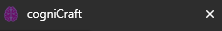

* A header with the game title and logo.

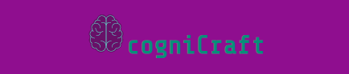

* A footer with my own social links.

The Main menu prvides 3 options.

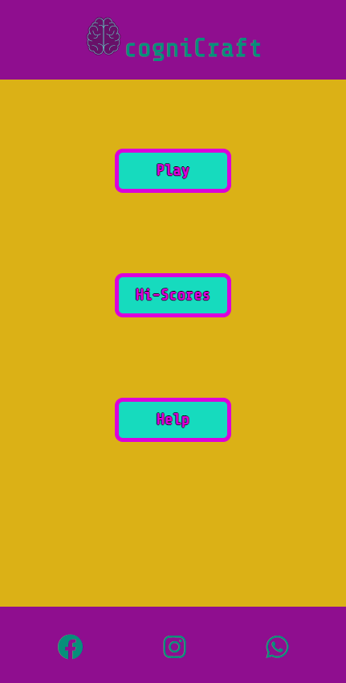

* Play menu: After clicking on the main menu the javascript code modifies the DOM and a gamescreen appeares with
an input window for entering the Username. The site will not let you to enter only spaces as a username.

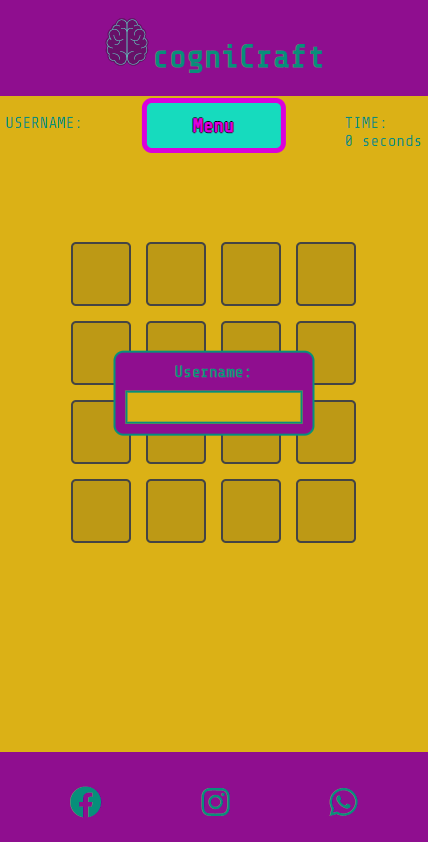

* After the game starts the player has to find all the matchink colour pairs as fast as possible. The username displays in the top
 left corner and the timer displays in the top riht corner.

 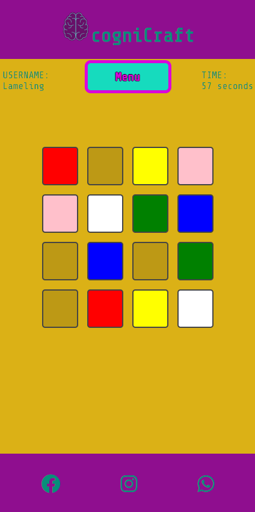

* When the player managed to find all the matching pairs the game displays the username and the time in the same window which was 
the username input before. The player clicks the Save and Reset button and the highscore gets saved in the localstorage.

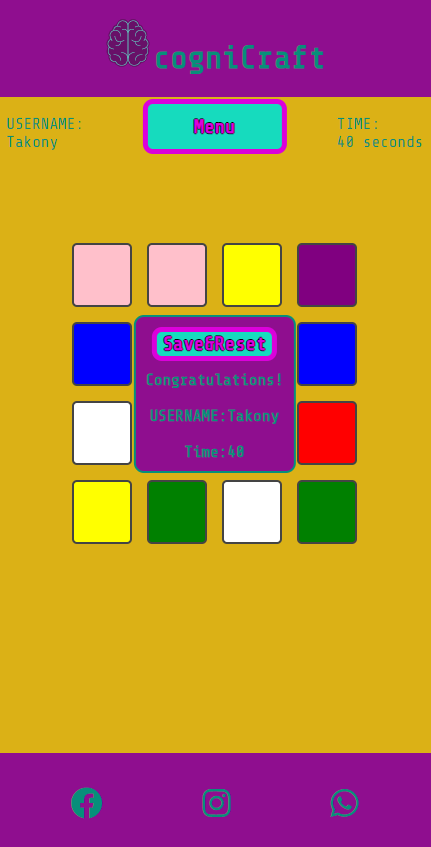

High Scores Screen

* In the high-scores menu the javascript code reads the data from the localstore and displays them in a top-10 Highscore table.
In the scrrenshot you can see incorrectly saved username data which still remained in my localstorage from an earlier stage of developement.

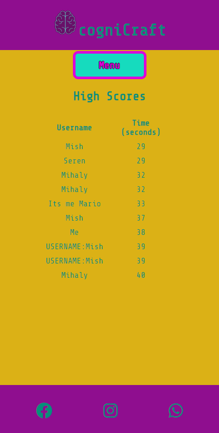

Help menu

* The help page provides some information about the game mechanics in case someone would need it.

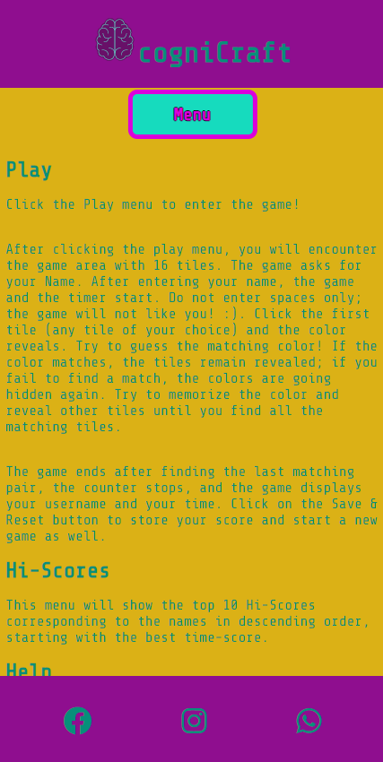

Each page has a menu button which takes back to the main menu. In reality the javascript code modifies the DOM. The whole game is using only one html file(index.html)

I then like to add a screenshot of each page of the site here, i use [amiresponsive](https://ui.dev/amiresponsive) which allows me to grab an image of the site as it would be displayed on mobile, tablet and desktop, this helps to show the responsiveness of the site.

### Future Implementations

In the future I will add sounds and a more interesting background as well.

### Accessibility

Be an amazing developer and get used to thinking about accessibility in all of your projects!

This is the place to make a note of anything you have done with accessibility in mind. Some examples include:

Have you used icons and added aria-labels to enable screen readers to understand these?
Have you ensured your site meets the minimum contrast requirements?
Have you chosen fonts that are dyslexia/accessible friendly?

Code Institute have an amazing channel for all things accessibility (a11y-accessibility) I would highly recommend joining this channel as it contains a wealth of information about accessibility and what we can do as developers to be more inclusive.

## Technologies Used

👩🏻‍💻 View an example of a completed Technologies Used section [here](https://github.com/kera-cudmore/Bully-Book-Club#Technologies-Used)

### Languages Used

Make a note here of all the languages used in creating your project. For the first project this will most likely just be HTML & CSS.

### Frameworks, Libraries & Programs Used

Add any frameworks, libraries or programs used while creating your project.

Make sure to include things like git, GitHub, the program used to make your wireframes, any programs used to compress your images, did you use a CSS framework like Bootstrap? If so add it here (add the version used).

A great tip for this section is to include them as you use them, that way you won't forget what you ended up using when you get to the end of your project.

## Deployment & Local Development

👩🏻‍💻 View an example of a completed Deployment & Local Development section [here](https://github.com/kera-cudmore/TheQuizArms#Deployment)

### Deployment

Include instructions here on how to deploy your project. For your first project you will most likely be using GitHub Pages.

### Local Development

The local development section gives instructions on how someone else could make a copy of your project to play with on their local machine. This section will get more complex in the later projects, and can be a great reference to yourself if you forget how to do this.

#### How to Fork

Place instructions on how to fork your project here.

#### How to Clone

Place instructions on how to clone your project here.

## Testing

Start as you mean to go on - and get used to writing a TESTING.md file from the very first project!

Testing requirements aren't massive for your first project, however if you start using a TESTING.md file from your first project you will thank yourself later when completing your later projects, which will contain much more information.
  
Use this part of the README to link to your TESTING.md file - you can view the example TESTING.md file [here](milestone1-testing.md)

## Credits

👩🏻‍💻 View an example of a completed Credits section [here](https://github.com/kera-cudmore/BookWorm#Credits)

The Credits section is where you can credit all the people and sources you used throughout your project.

### Code Used

If you have used some code in your project that you didn't write, this is the place to make note of it. Credit the author of the code and if possible a link to where you found the code. You could also add in a brief description of what the code does, or what you are using it for here.

### Content

Who wrote the content for the website? Was it yourself - or have you made the site for someone and they specified what the site was to say? This is the best place to put this information.

###  Media

If you have used any media on your site (images, audio, video etc) you can credit them here. I like to link back to the source where I found the media, and include where on the site the image is used.
  
###  Acknowledgments

If someone helped you out during your project, you can acknowledge them here! For example someone may have taken the time to help you on slack with a problem. Pop a little thank you here with a note of what they helped you with (I like to try and link back to their GitHub or Linked In account too). This is also a great place to thank your mentor and tutor support if you used them.